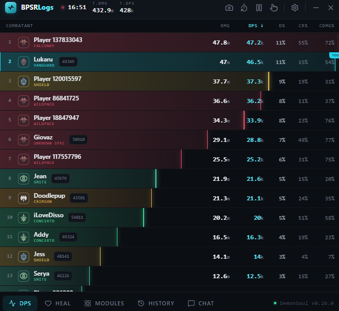
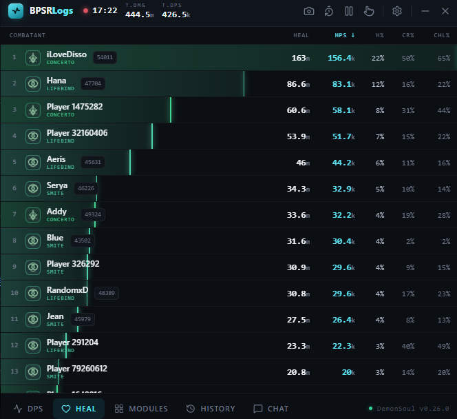
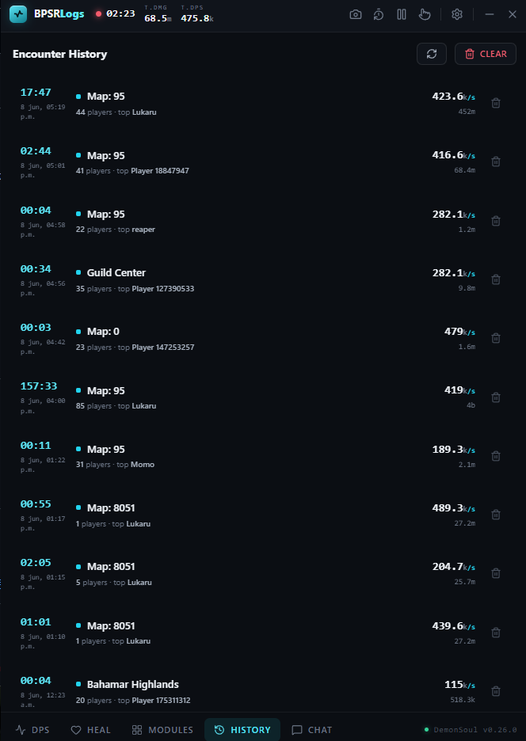
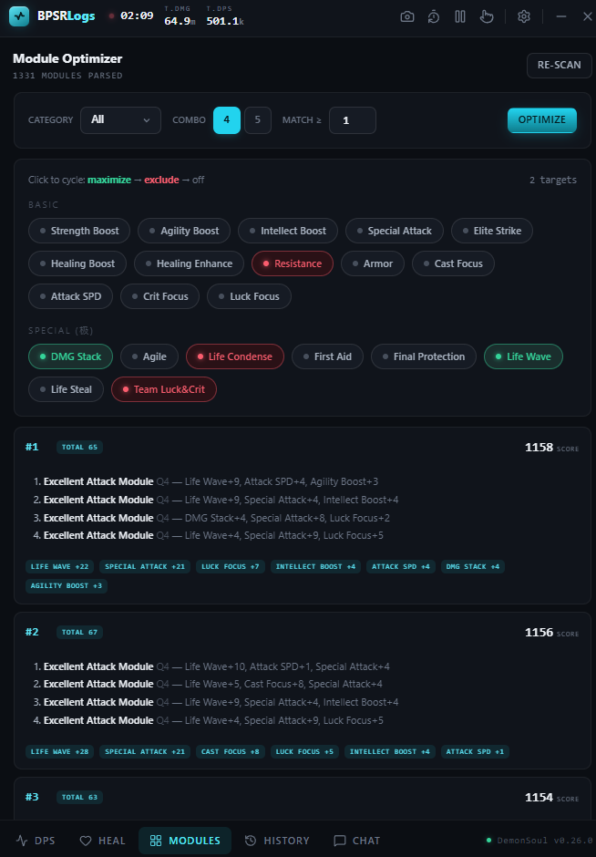
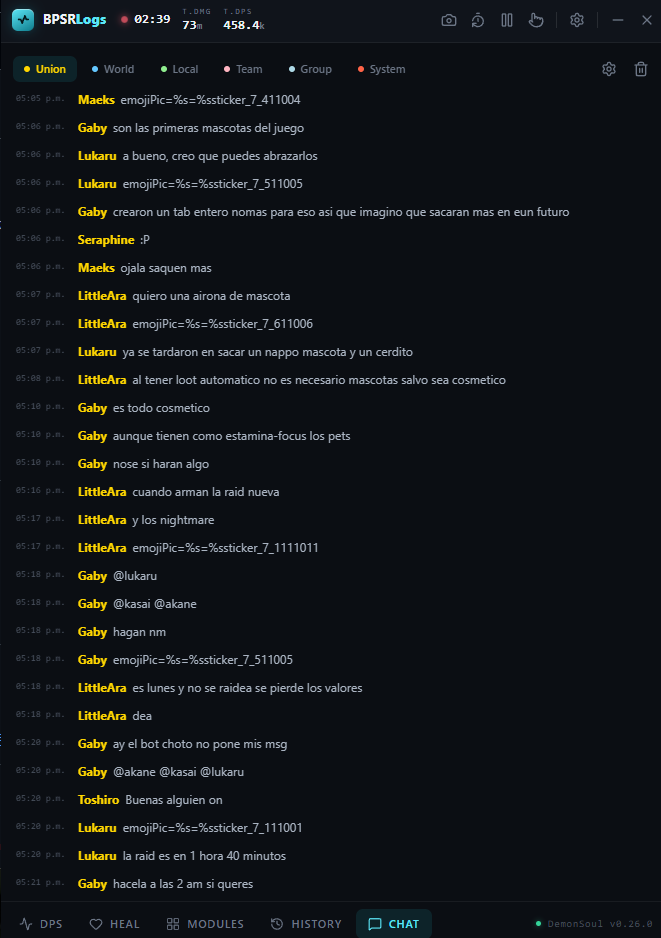
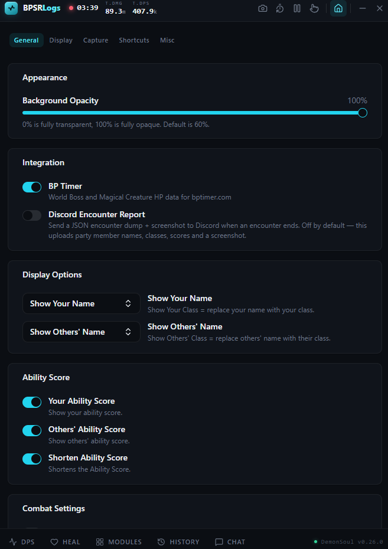

# DemonSoul - ZDPS Meter (BPSR Logs)

A beautifully redesigned, "blazingly fast" open-source DPS & HPS meter for Blue Protocol: Star Resonance. 

**Key Features:**
- 🎨 **Tactical HUD UI Overhaul:** Brand new, sleek interface
- 🤖 **Discord Webhook:** Automatic DemonSoul encounter reports
- 📊 **Encounter History:** Local SQLite database for past meters
- ⚙️ **AutoMod:** Built-in Module Optimizer directly in the app
- 💬 **Chat Logs:** Guild chat capture & dedupe relay

 

This project is a heavily modified **fork** of the original [winjwinj/bpsr-logs](https://github.com/winjwinj/bpsr-logs), built to add powerful new features and a complete aesthetic overhaul, tailored specifically for the DemonSoul community.

> **Plug & Play:** Download the installer from the [Releases page](https://github.com/saptia14/bpsr-logs-demon-soul/releases/latest), run it, and launch the game. No configuration is required.

---

## ✨ What's New in this Fork?

We've completely overhauled the original meter to make it look better and do much more. Here are the major additions:

- **Full UI Overhaul (Tactical HUD)**: A brand new, sleek, and modern interface. Clean tables, better class colors, and a much more polished experience.
- **New Cross-Platform Icons**: Custom, high-quality app icons designed for this fork.
- **DemonSoul Discord Webhook Integration**: A built-in, hardcoded integration that automatically sends encounter reports (including a JSON dump and a screenshot of the meter) straight to the DemonSoul Discord after every fight. 
- **Encounter History Database**: The app now saves your past encounters into a local SQLite database. You can review your previous damage and healing meters directly in the new History tab!
- **Built-in Module Optimizer (AutoMod)**: No need for external websites anymore. The app intercepts your gear modules straight from the game and calculates the absolute best 4- or 5-module combinations for you, entirely locally.
- **Chat History Logging**: A new chat history logger that captures Guild (Union) chat and relays it to Discord via a dedicated DemonSoul dedupe API.

---

## 📸 Screenshots

### Live DPS Meter
Real-time damage breakdown, complete with critical and lucky hits tracking.

### Live Heal Meter
Real-time healing breakdown per player and skill.

### Encounter History
Review your past fights and check your previous meters with the newly integrated local database.

### Module Optimizer (AutoMod)
Find the strongest combination of your gear modules without leaving the app or re-logging.

### Chat Logs
Review in-game chat history and easily share it via the Discord dedupe relay.

### Settings
Easily configure hotkeys, UI transparency, meter rules, and Discord integrations.

---

## 🛠️ FAQ & Help

### Is it bannable?
It operates in **sniff mode** via the WinDivert driver, meaning it only passively reads TCP traffic. It **does not** inject into the game client or modify any packets. 

### Does it mine Bitcoin?
No. The code is completely open-source, and you can inspect it yourself. Some antiviruses falsely flag the WinDivert driver. If you encounter issues, try adding an exception for the folder in Windows Defender.

### Missing `WinDivert64.sys`?
If your meter isn't picking up the game, your antivirus might have quarantined `WinDivert64.sys`. Add the installation folder to your antivirus exceptions and reinstall the meter.

### How do I use ExitLag?
ExitLag redirects packets in a way that hides them from WinDivert. Change your ExitLag settings to **Packet redirection method > Legacy - NDIS**.

---

## 🤝 Contributing
- **Framework**: Tauri 2.0 (Rust backend, Svelte 5 / SvelteKit frontend).
- **Requirements**: Node.js and Rust.
- Run `npm install` followed by `npm run tauri dev` to get started.

Join our [Discord](https://discord.gg/Tcc54ST5BU) and grab the Developer role if you'd like to help out!
